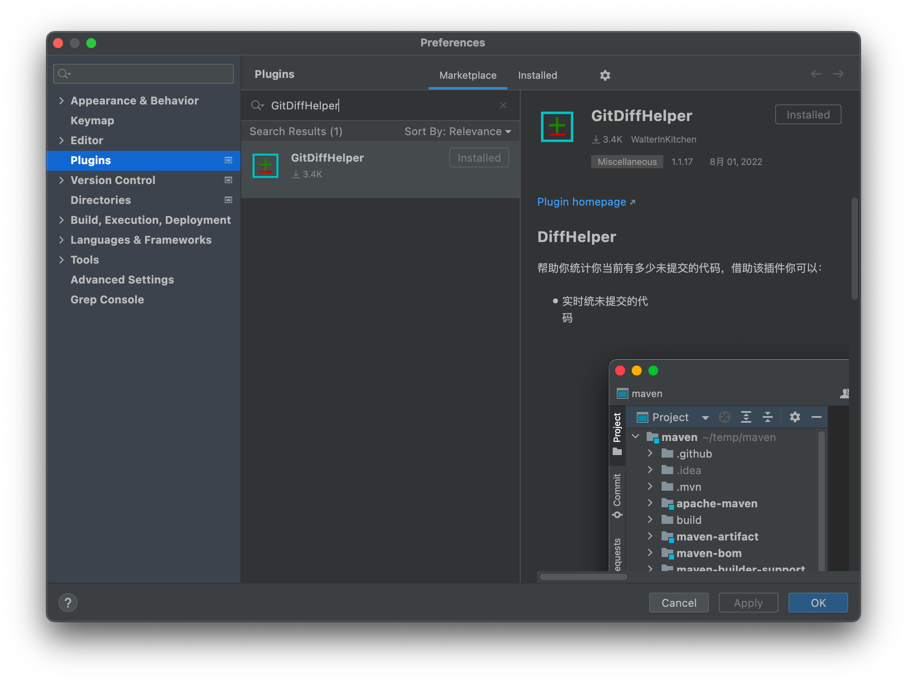
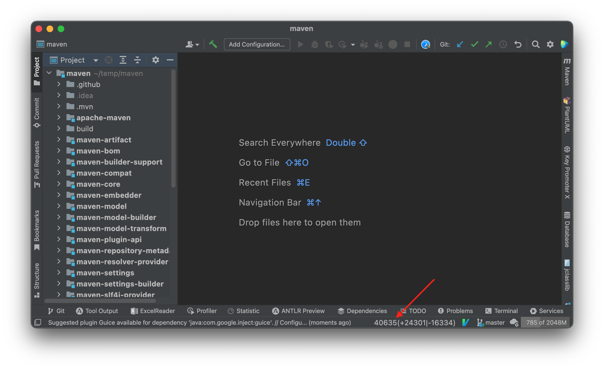
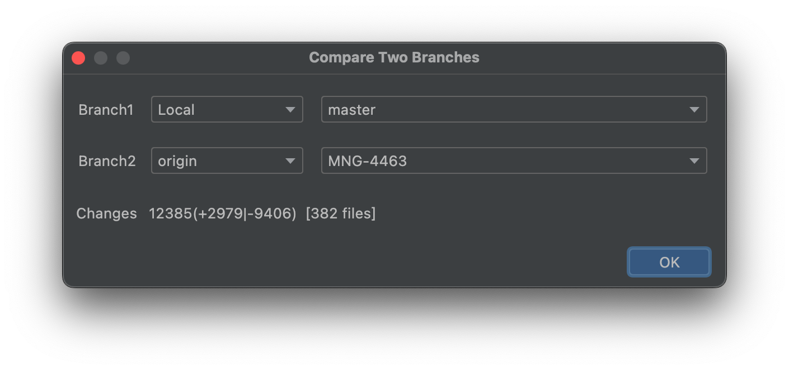

# IntelliJ IDEA git修改统计插件

## 起因

公司新增了MR不能超过500行的要求。如果MR修改小于500行，只需要committer与其他开发同学打分总和达到3分就可以合入。

如果一次MR的代码超过500行，MR提交人需要拉会几个伙伴和committer进行集中检视，开发同学需要向伙伴们讲解代码的设计思路，也要回答各个同学的对代码的疑问；只有经过集中检视并且MR总分达到3分这个MR才能合入。

公司的MR检视流程可以让一些比较明显的缺陷在合入前就被识别出来。例如潜在的SQL注入缺陷，不合理的查询语句等。但是一个超过500行修改的MR会增大各个检视同学的负担，最可能的情况是大多数检视同学匆匆扫了一眼代码后给代码默默的打上1分。这样就失去了MR检视流程的作用，所以为了减少检视同学的负担，公司规定每个MR超过500行后需要集中检视，大家一起上会检视代码。

## 问题

500行的限制实施后不出意外地给开发同学带来了不少麻烦。一个典型的情况是，开发同学A忙活了半天提交MR后发现修改了700行，如果开一个集中检视需要协调各位开发同学的时间，过于麻烦。于是同学A选择撤回MR，将这个MR拆分为2个小于500行的提交后再分两次提交MR。

这里小A同学从第一次提交MR到MR被拆成2个提交之间的操作所花费的时间属于不必要的浪费，如果用的是Java这种需要编译的语言，一个提交拆分为两个还需要使得编译能够通过，耗费的时间将会更多。

## 方案

如果开发同学知道现在有多少代码还未提交，就能在修改接近500行前commit修改并提交MR，然后接着写后面的逻辑。

但是Java、C++开发同学可能会说，我500行的时候功能还没写完，代码还不能编译通过怎么提交MR。答案就是要有良好的编码习惯，先编写抽象将问题的整体逻辑组织起来，这时业务逻辑由接口和抽象类组成并且可以编译通过，commit并提交MR；然后接着写实现细节或另一部分的抽象，commit后提MR。如此往复就能通过多个不超过500行的MR将功能实现出来。

## 工具

有了方案就开始做工具，工具是基于Intellij Idea平台开发的插件，可以在插件市场搜索**GitDiffHelper**下载到。

**插件只有简单的两个功能**

如下图，在插件底部会的状态栏显示当前未提交的修改代码行数。

也可以比较两个分支间的差异。

插件已开源到[GitHub](https://github.com/WalterInKitchen/git_diff_idea_plugin)，目前只是一个可用的最小实现，如果你愿意可以完善它。
